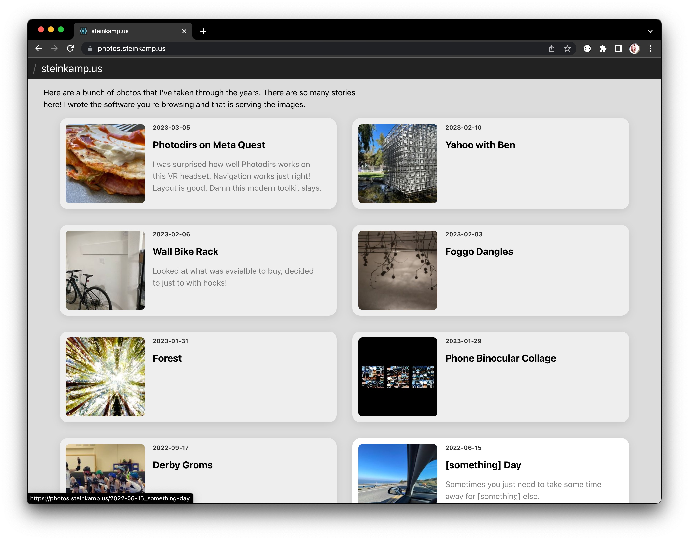
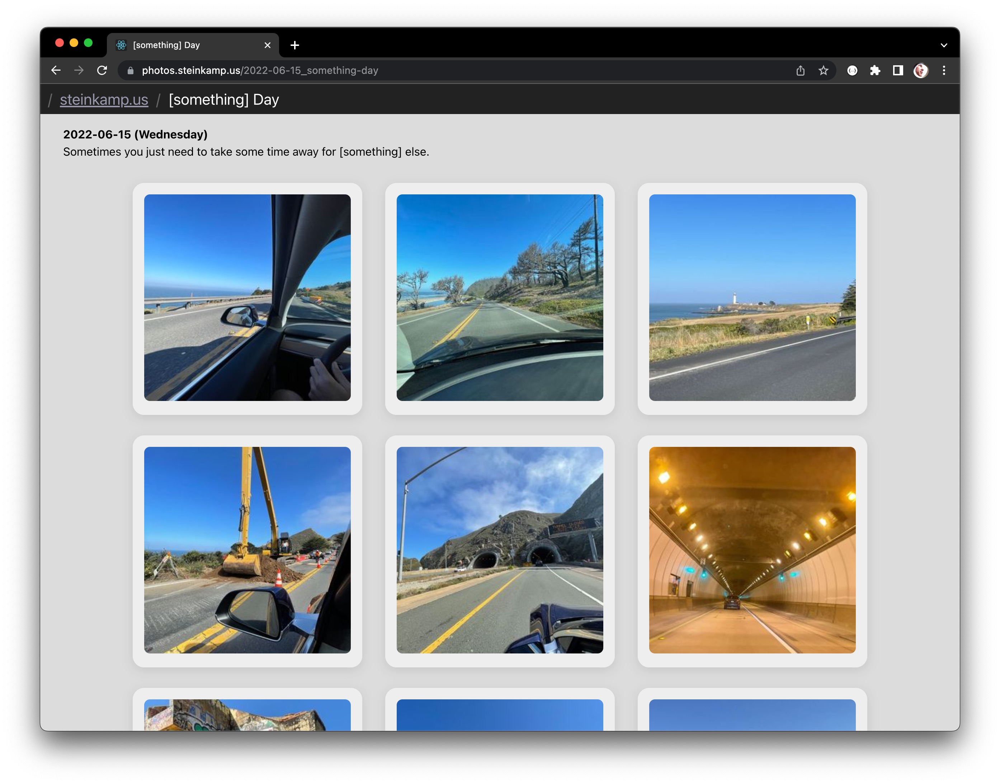
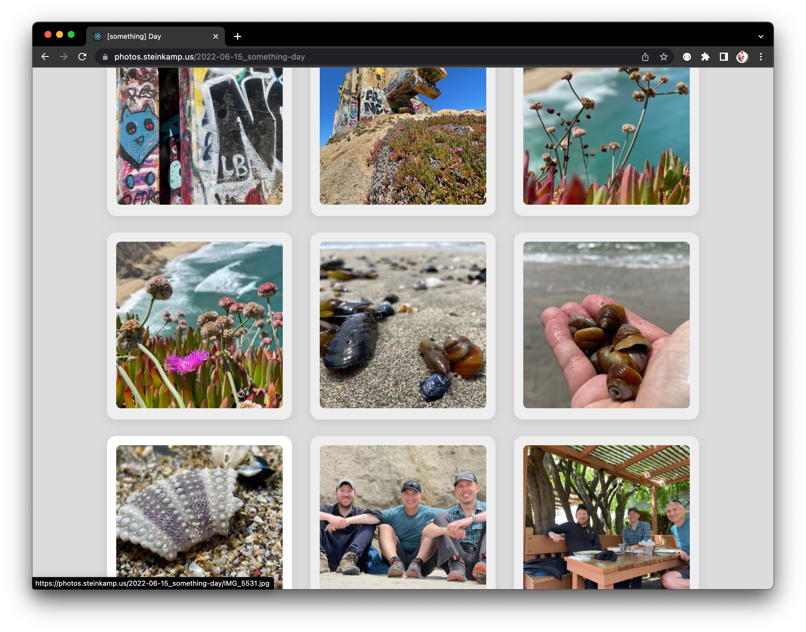
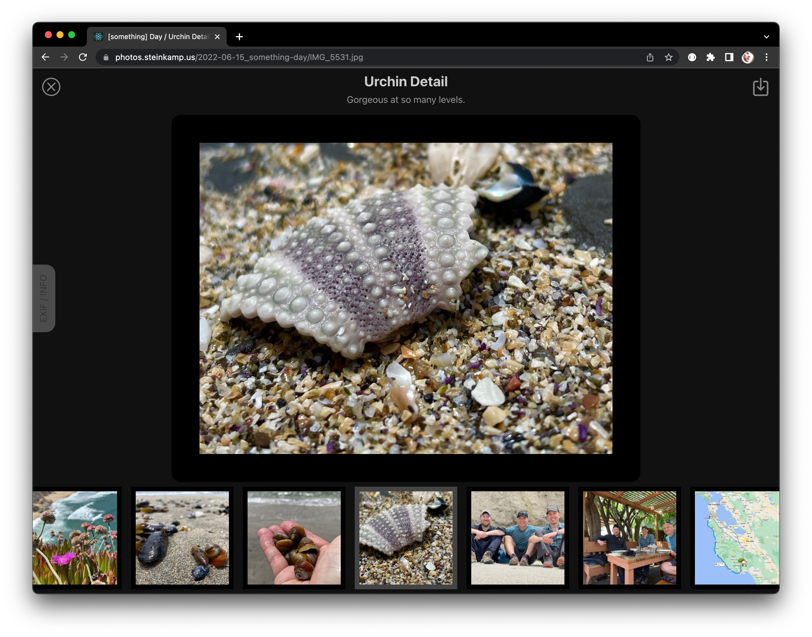
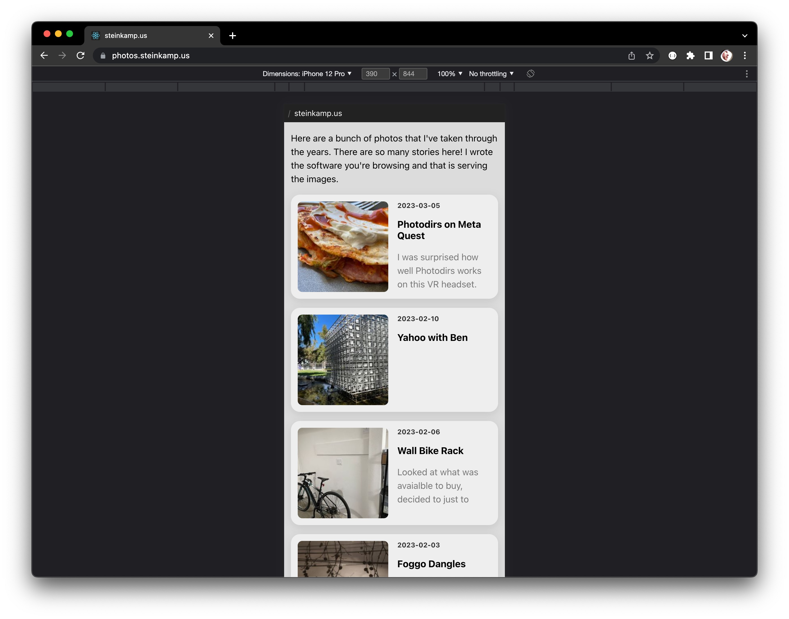
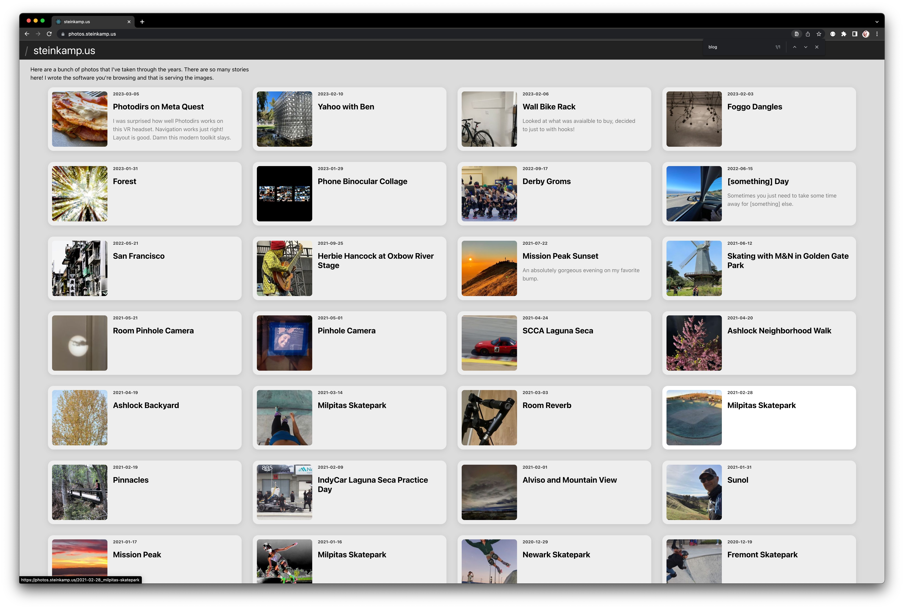
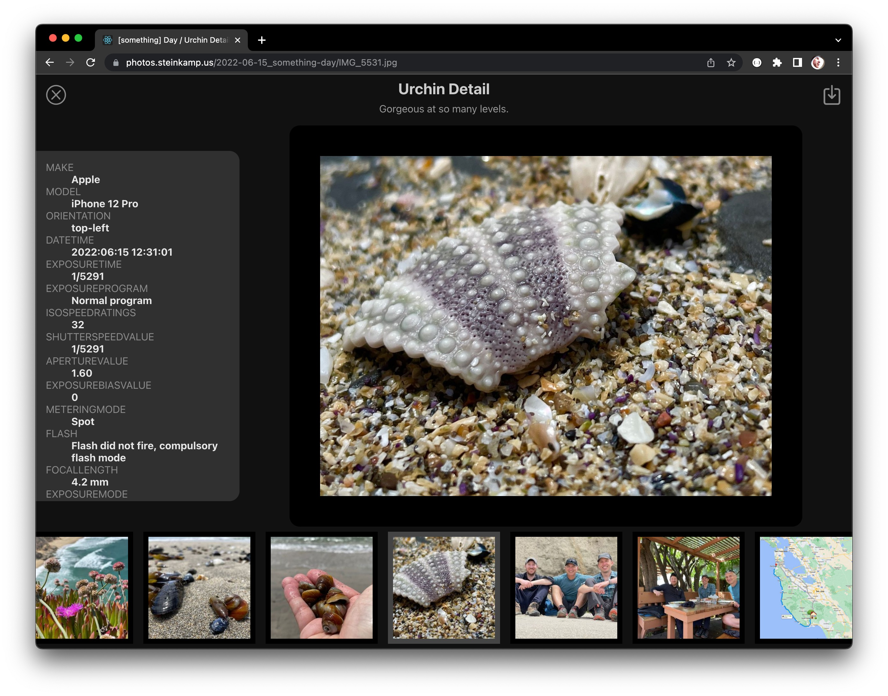
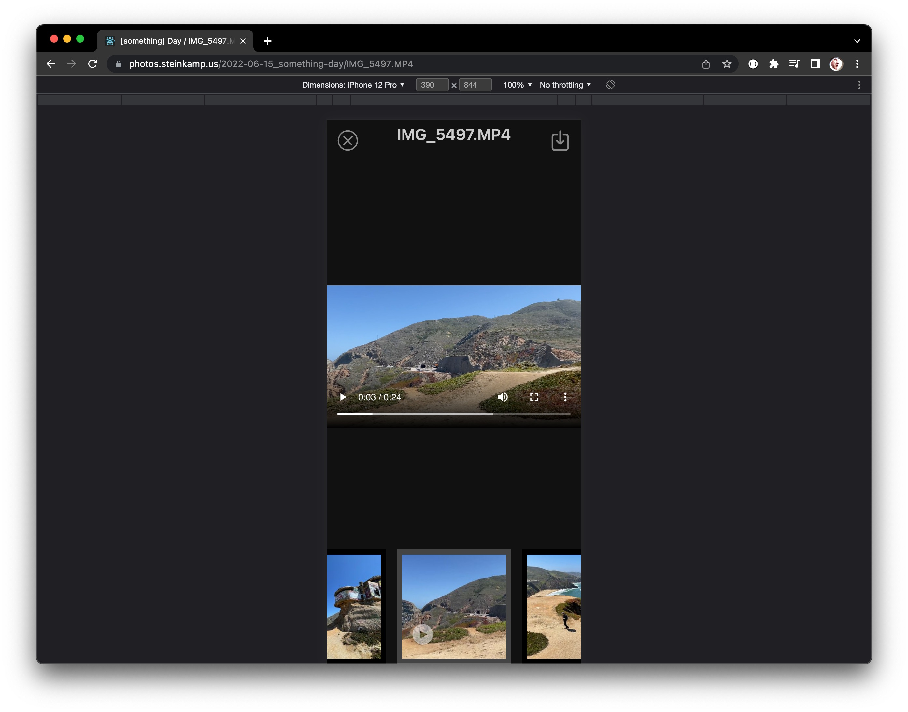

# photodirs

A filesystem-first photo and video serving, cropping, and resizing platform. Metadata is easily accessible from a full and open JSON API. New/Changed/Deleted files incorporated automatically. Comes with a very lightweight browsing UI that uses the API.

Photodirs was made with the following design goals:

* Your directory structure is your album structure
* Your originals are mounted read-only in the containers so there is no possibility of anything happening to them.
* Directories can be nested arbitrarily deep
* New files or directories are immediately available, and common resizing is triggered automatically, making for a lightning fast experience.
* Ergonomic photo URLs (i.e. no UUIDs anywhere)
* Flexible, simple URL-based resizing and cropping options for photos
* A fast, lightweight album/photo browsing web UI
* Publicly accessible (no authentication requried)
* Directories can have an optional YAML metadata file to override title, set description, specify an album image, etc.
    * Future: disable display, control photo sort order, optional file includelist, or anything else you would like to include
* Support for EXIF/XMP metadata
* HEIC and RAW files (DNG, CRW, CR2, etc) are converted to JPEG when served
* Converted/scaled images and videos are cached locally, and preserved between server restarts.
* CDN-friendly cache headers
* Support for video! (ffmpeg)

# Screenshots

| Home page:                                            | Album page:                                            |
|-------------------------------------------------------|--------------------------------------------------------|
|        |        |

| Scroll down Album page:                               | Photo/Video viewer:                                    |
|-------------------------------------------------------|--------------------------------------------------------|
|  |       |

| Works well on small screens:                          | Works well on big screens:                             |
|-------------------------------------------------------|--------------------------------------------------------|
|       |    |

| EXIF panel slides out:                                | Plays videos everywhere:                               |
|-------------------------------------------------------|--------------------------------------------------------|
|        |   |

## Requirements
The ability to run x86_64/amd64 Docker images.

## Running photodirs

Photodirs requires Docker Compose to run.

You will need to edit the `/albums` volume in the `docker-compose.yml` file to point to your album root. See the last line here:

```
  api:
    build:
      context: ./api
      target: prod
    restart: unless-stopped
    volumes:
      - prod_cache:/cache
      - /PATH/TO/YOUR/PHOTOS:/albums:ro
```

Note that `/albums` is mounted Read Only (`:ro`). There is no chance Photodirs
can do anything to your original files or directory structure.

### Production Mode
Use this mode if you are not actively developing on Photodirs. It will build an
optimized, static version of the frontend code. The backend code runs mostly the
same as development mode, just without auto-reloading.

You will need to edit the `docker-compose.yml` file in the `prod/` directory to
use the correct path to your albums directory. Note that this is mounted "Read
Only" so even if I had a terrible bug in my code, I could not mess up your
originals.

After you have changed the `/albums` mount source, then you can start in
Production mode.

To start Photodirs in PRODUCTION mode, run:
```
docker compose up -d
```
The containers are configured to start on boot, unless explicitly stopped.

If you want to monitor the log output, then you can run:
```
docker logs -f
```

### Development Mode
This brings up all the servers in "watch" mode and mounts the repo into the
container. Use your text editor of choice and get auto-reloading without
installing anything but Docker on your computer.

To start the service in DEVELOPMENT mode, run:
```
cd dev
docker compose up
```

To get a shell in the `api` container, you can run:
```
docker compose exec api bash
```

This also works the same for the `frontend` and `nginx` containers.


## Fetching Photos

### GET /photo/:path?:options or :photoPath?:options
Returns a file, with options honored. Images can even be in the root directory.

Options can include:
* `size=( HxW | orig )` - specify a maximum image size as Height x Width. By default, images are resized to fit in a 1600px square box.
* `crop` - fill the box of the specified size, cropping the image

Examples:
* `/photo/2023-03-01_hawaii/CRW_1000.CR2?size=orig`  
Will return the original image file. RAW originals are downloaded as RAW.
* `/photo/2023-03-01_hawaii/IMG_1001.JPG?size=200x200&crop`  
Will always return a 200x200px JPEG image, cropping the long side if it is not square.
* `/photo/2023-03-01_hawaii/IMG_1002.HEIC?size=1000x1000`  
Will return a JPEG image whose long side is 1000px, i.e. will fit inside of the specified `size` box without cropping.


## REST API

### GET /api/albums
### GET /api/albums/:album-path
Return photo albums and any supported files in the given path. Note the HATEOS-friendly `apiPath` property.
```
{
  "type": "album",
  "title": "My Awesome Photo Gallery",
  "description": "My cool collection of photos",
  "thumb": "/photo/2023-03-01_hawaii/CRW_1234.CR2"
  "albums": [
    { 
      "type": "album",
      "title": "Hawaii Vacation 2023",
      "date": "2023-03-01T00:00:00.000Z",
      "apiPath": "/api/album/2023-03-01_hawaii",
      "path": "/2023-03-01_hawaii",
      "uriPath": "/2023-03-01_hawaii",
      "description": "Some cool photos",
      "thumbnail": "/photo/2023-03-01_hawaii/CRW_1234.CR2"
    }, ...  ],
  "files": [
    {
      type: "photo",
      name: "greydangle.jpg",
      apiPath: "/api/albums/2023-02-10%20Yahoo%20with%20Ben/greydangle.jpg",
      path: "/2023-02-10 Yahoo with Ben/greydangle.jpg",
      photoPath: "/photo/2023-02-10%20Yahoo%20with%20Ben/greydangle.jpg",
      albumPath: "/2023-02-10 Yahoo with Ben",
      fileName: "greydangle.jpg",
      title : "greydangle.jpg",
      uriPath: "/2023-02-10%20Yahoo%20with%20Ben/greydangle.jpg"
    }, 
    ...
  ]
}
```

### GET /api/photo/:album/:file
Returns metadata for a given photo. Metadata can come from the EXIF data
embedded in the photo, an XMP sidecar file, or a YAML file with the same name
as the photo, just with a `.yml` extension (e.g. `IMG_1024.jpg.yml`).

```
{
  "type": "photo",
  "name": "IMG_7809.JPG",
  "path": "/2023-02-10_yahoo_with ben/IMG_7809.JPG",
  "albumPath": "/2023-02-10_yahoo_with%20ben",
  "photoPath": "/photo/2023-02-10_yahoo_with%20ben/IMG_7809.JPG",
  "apiPath": "/api/albums/2023-02-10_yahoo_with%20ben/IMG_7809.JPG",
  "fileName": "IMG_7809.JPG",
  "title": "IMG_7809.JPG",
  "uriPath": "/2023-02-10_yahoo_with%20ben/IMG_7809.JPG",
  "exif": {
    "Make": "Apple",
    "Model": "iPhone 12 Pro",
    "Orientation": "top-left",
    "DateTime": "2023:02:09 13:47:02",
    "ExposureTime": "1/173",
    "ExposureProgram": "Normal program",
    "ISOSpeedRatings": 25,
    "ShutterSpeedValue": "1/173",
    "ApertureValue": "2.40",
    "ExposureBiasValue": "0",
    "MeteringMode": "Pattern",
    "Flash": "Flash did not fire, compulsory flash mode",
    "FocalLength": "1.54 mm",
    "ExposureMode": "Auto exposure",
    "WhiteBalance": "Auto white balance",
    "FocalLengthIn35mmFilm": 14,
    "LensSpecification": "1.5399999618512084-6 mm f/2.4",
    "LensMake": "Apple",
    "LensModel": "iPhone 12 Pro back triple camera 1.54mm f/2.4",
    "GPSLatitude": 37.41822777777777,
    "GPSLongitude": 122.02579444444444,
    "GPSAltitude": "32.95594792224006 m",
    "GPSSpeed": "0",
    "GPSSpeedRef": "Kilometers per hour",
    "GPSImgDirection": "126.96919263456091"
  },
  "album": {
    "type": "album",
    "title": "Hawaii Vacation 2023",
    "date": "2023-03-01T00:00:00.000Z",
    "apiPath": "/api/album/2023-03-01_hawaii",
    "path": "/2023-03-01_hawaii",
    "uriPath": "/2023-03-01_hawaii",
    "description": "Some cool photos",
    "thumbnail": "/photo/2023-03-01_hawaii/CRW_1234.CR2"
  }
}
```

## Utilizes / Props
* [Sharp](https://sharp.pixelplumbing.com/) - JPEG conversion and resizing
* [dcraw](https://www.dechifro.org/dcraw/) - Convert RAW to TIFF for ingestion by Sharp to make a JPEG
* [ffmpeg](https://ffmpeg.org/) - Powers any video source on the internet. Should be the most stodgy library but is absolutely wonderful to learn and use. Kudos to this team for focusing on the user experience.
* [node-tdd-base](https://github.com/zsteinkamp/node-tdd-base) - The most primitive framework for a nice Node.js dev experience

## Caching
Converting large RAW or HEIF images is slow, as is resizing large JPEGs. Photodirs caches converted/resized images in 200 pixel increments, up to 3000px. This helps to protect against a bad actor filling your cache disk by requesting every possible image size.

You can still request any image size, and Photodirs will use the cached image that is equal to or greater than the size you are requesting to fulfill your request, resizing it on-the-fly to your specification. The `Cache-control: public` header is sent with images, so that intermediate web caches, CDNs, and browsers will cache the final output.

## Setting Photo Title / Description
This repo contains a utility in `bin/exif-set` that you can use to set the correct title and description in your image files. To use it, you will need the `exiftool` command installed in your system. Install with your favorite package manager, e.g.:
* MAC: `brew install exiftool`
* LINUX: `sudo apt install exiftool`

To use it, just run the command from the terminal (you may want to copy the script to somewhere in your `$PATH`), passing a filename as an arg:
```
> exif-set kimchi_hands.jpg 
Title []: Kimchi Hands
Description []: Hands after mixing the cabbage with the kimchi paste.
Keywords []: 
    1 image files updated
Object Name                     : Kimchi Hands
Caption-Abstract                : Hands after mixing the cabbage with the kimchi paste.
Keywords                        : -
```
I decided that leaning more heavily into EXIF was a good choice for investing this work of naming things to work better with other/future tools. I have written many photo galleries, and the data format is always different. EXIF just makes sense here.

## TODO
Random dumping ground / rough sort of pending features or ideas. Put yours here too!

* Video support
* UI Polish
  * More keboard controls, e.g. up-arrow to go up a folder level
