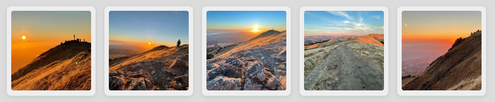
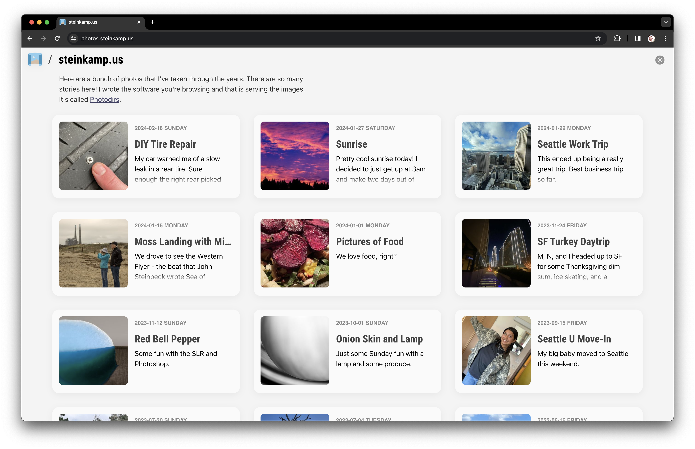
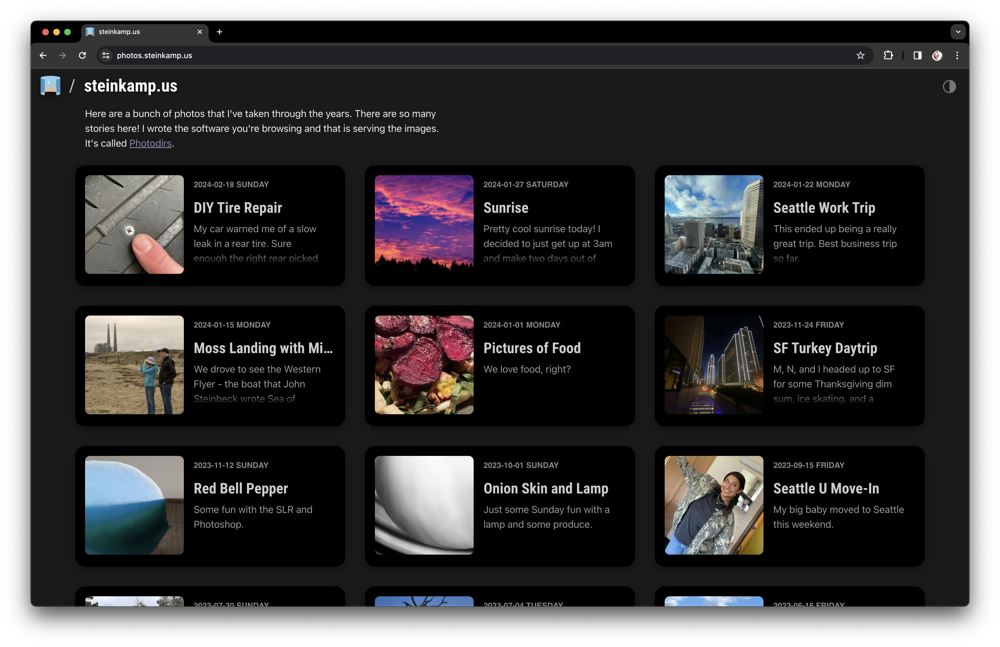

# Photodirs

Filesystem-first media serving and browsing solution, with native support for HEIC, RAW, and most video formats. Auto-resizing image hosting, auto-transcoding video hosting, a straightforward browsing UI, and an efficient (and optional) Admin UI.

Directory/album metadata is stored in sensible `album.yml` files that can be useful with other tools, text editors, or future applications. Image and video metadata are stored in the files themselves, using standard EXIF metadata.

New/Changed/Deleted files are auto-discovered and pre-resized/transcoded according to your configuration. The included browsing UI is also a good benchmark implementation of a Photodirs API client and looks good on any device or screen size.



## Quick Start

On your Docker Compose capable system, clone this repo then run:

```
make
```

This will begin an interactive configuration script then start the server!

## Design Goals

Photodirs was made with the following design goals:

- Your directory structure is your album structure
- Photodirs wants to leave your media directory better than it found it. You will use other software in the future, and Photodirs can make that as easy as possible by writing metadata using standard and sensible forms.
- Your originals are mounted read-only in the containers so there is no possibility of anything happening to them.
- NEW: Optional Admin container allows you to manage your album and originals' metadata from a web GUI restricted to your private network.
- Directories can be nested arbitrarily deep
- New files or directories are detected automatically. Common resizing and/or transcoding is triggered automatically, making for a lightning fast browsing experience.
- Ergonomic photo URLs, including simple URL-based resizing and cropping options (i.e. no UUIDs anywhere - see Fetching Photos below)
- A fast, keyboard-supported, swipe-enabled, lightweight album/photo browsing web UI that implements lazy image loading and image `srcSet`s.
- Publicly accessible (no authentication required)
- Uses regular HTML `` and `<video>` tags to make "Save As...", copying, etc as easy as possible.
- Directories can have an optional YAML metadata file to override title, set description, specify an album image, etc.
  - Future: disable display, control photo sort order, optional file include list, or anything else you would like to include
- Support for reading (and optional writing) EXIF/XMP metadata
- HEIC and RAW files (DNG, CRW, CR2, etc) are converted to JPEG when served
- Converted/scaled images and videos are cached locally, and preserved between server restarts.
- CDN-friendly cache headers
- Support for video files
- Support for OpenGraph content previews (title, description, thumbnail)
- Easy integration with HTML image Source Sets, e.g.  
  ``

## Screenshots

| Home Page (Light)                                | Home Page (Dark)                               |
| ------------------------------------------------ | ---------------------------------------------- |
|  |  |

| Album Page                           | Photo/Video viewer:                  |
| ------------------------------------ | ------------------------------------ |
|  |  |

## Requirements

Photodirs requires Docker Compose on an x86_64 or amd64 system to run.

## Running Photodirs

Run this command to configure Photodirs and start the server:

```
> make
```

This will start a script that asks you some questions about how you want to run
Photodirs and where to find your originals folder.

This script writes out a `docker-compose.yml` file that you can open, inspect,
modify, etc.

The script then does a `docker compose up -d` to start Photodirs.

### NFS Support

The Photodirs installation script supports mounting your originals folder either
locally or over NFS.

I found that if I relied on NFS connections made via
`/etc/fstab`, they would not come up properly on reboot in the containers. The
containers were coming up before the NFS connection was made, thus presenting
Docker with empty mountpoints.

Photodirs can generate a `docker-compose.yml` that will manage its own NFS connection. This is what I use, and it has been completely reliable for me so far.

## Optional Admin

One step in the configuration script asks if you want to run the Admin container. This allows you to manage album and media file metadata directly in your web browser. Otherwise you would need to edit the `album.yml` files and/or set EXIF metadata manually.

Photodirs Admin container runs on a separate port from the public web server. This allows you to only allow access to the Admin port from your local LAN (by not forwarding or proxying the port to your public connection, if you have one).

This special Admin UI server has access to the special Admin API server, which can mount your originals folder read/write in order to manage the metadata.

Photodirs is against any sort of application lock-in, so all the metadata that is written is either standards-based (EXIF/XMP) or in a sensible, human-readable and editable form (`album.yml`). This gives you portability to future better solutions.

## Album Metadata (album.yml)

Each directory in the tree under the `/albums` mount in Photodirs can optionally have an `album.yml` file.

This file specifies metadata for the album. At the time, the following properties are supported:

- _title_ - The album title. By default, the directory name is used as the title.
- _description_ - A description of the album. Markdown is supported.
- _thumbnail_ - The original name of of an image or video file that you would like to use as a thumbnail. By default, the first file in the directory is used.

Here is an example with a multi-paragraph description:

```yaml
title: Yahoo with Ben
description: |
  What a great chance to relive some epic memories with one of my favorite peoples.

  Ben and I were teammates when Yahoo! moved into this campus. We famously took a short walk out on the levees that turned into a 3+ hour ordeal due to some confusing twists and turns the trails take next to channels of muddy water.

  Google owns this property now, since Verizon (who purchased most of Yahoo!) moved out. They have held off occupying it though.
thumbnail: IMG_7807.JPG
```

## Fetching Photos

### GET /photo/:path?:options

Returns a file, with options honored. Images can even be in the root directory.

Options can include:

- `size=( HxW | orig )` - specify a maximum image size as Height x Width. By default, images are resized to fit in a 1600px square box.
- `crop` - fill the box of the specified size, cropping the image

Examples:

- `/photo/2023-03-01_hawaii/IMG_6789.JPG`  
  will return a JPEG scaled to fit inside of a 1600x1600px box.
- `/photo/2023-03-01_hawaii/CRW_1000.CR2`  
  will return a JPEG (converted from the RAW CR2 file) scaled to fit inside of a 1600x1600px box.
- `/photo/2023-03-01_hawaii/CRW_1000.CR2?size=orig`  
  will return the original image file. RAW originals are downloaded as RAW.
- `/photo/2023-03-01_hawaii/IMG_1001.JPG?size=200x200&crop`  
  will always return a 200x200px JPEG image, cropping the long side if it is not square.
- `/photo/2023-03-01_hawaii/IMG_1002.HEIC?size=1000x1000`  
  will return a JPEG image whose long side is 1000px, i.e. will fit inside of the specified `size` box without cropping.
- `/photo/2023-03-01_hawaii/MVI_1001.MOV?size=300x300&crop`  
  will return a JPEG image thumbnail of the named video, cropped to a 300px square.

## Fetching Videos

### GET /video/:path

Returns a transcoded video (MP4, 1080P max)

Examples:

- `/video/my_vacation/MOVIE_0001.AVI`  
  will return an MP4 video, scaled down to 1080P if larger.
- `/video/my_vacation/MOVIE_0002.MOV`  
  will return an MP4 video, scaled down to 1080P if larger.
- `/video/my_vacation/MOVIE_0003.MP4`  
  will return an MP4 video, scaled down to 1080P if larger.

You can use these urls as sources in HTML `<video>` tags, along
with their photo URL counterpart to get a `poster=` image, e.g.

```
<video controls autoplay="true" poster="https://myphotodirs.com/photo/my_vacation/MOVIE_0001.AVI">
  <source src="https://myphotodirs.com/video/my_vacation/MOVIE_0001.AVI" type="video/mp4" />
</video>
```

In this example, even though the original file was an AVI, and the URLs say AVI,
the poster thumbnail will be an JPEG and the video source is an MP4.

## REST API

See the [Photodirs REST API doc](API.md) for details.

## Utilizes / Props

- [Sharp](https://sharp.pixelplumbing.com/) - JPEG conversion and resizing
- [dcraw](https://www.dechifro.org/dcraw/) - Convert RAW to TIFF for ingestion by Sharp to make a JPEG
- [ffmpeg](https://ffmpeg.org/) - Powers any video source on the internet. Should be the most stodgy library but is absolutely wonderful to learn and use. Kudos to this team for focusing on the user experience.
- [node-tdd-base](https://github.com/zsteinkamp/node-tdd-base) - The most primitive framework for a nice Node.js dev experience

## Caching

Converting large RAW or HEIF images is slow, as is resizing large JPEGs. Photodirs caches converted/resized images in 200 pixel increments, up to 3000px. This helps to protect against a bad actor filling your cache disk by requesting every possible image size.

You can still request any image size, and Photodirs will use the cached image that is equal to or greater than the size you are requesting to fulfill your request, resizing it on-the-fly to your specification. The `Cache-control: public` header is sent with images, so that intermediate web caches, CDNs, and browsers will cache the final output.

## My Photodirs Workflow

I'm a constant optimizer. When I see opportunities for reducing steps in a
process, I am energized to explore them. Digital media is a big part of our
lives now, and I think it's important that we retain ownership and stewardship
of our digitial lives. Softwares as a service and cloud providers will come and
go, but your memories are yours alone and should be treated as such.

My [NAS](https://truenas.com/) is the heart of my home network. On it, I have a shared called `photos` which holds of all the photos I want to keep and share. I wrote Photodirs to interface with this data (read-only) and provide a [first-rate API](API.md) and browsing interface, with an eye on making common tasks efficient and sensible.

This all fits together into a really seamless experience. Let's start with
mobile first...

### Mobile

- Select one or more pictures on the phone
- Tap the Share icon
- Tap `Save to Files...`.
- Select the `photos` share on the NAS (shared via SMB)
- Either choose an existing directory or create a new one
- Save the files

This also works well directly from the Files app to scan documents (with auto-cropping/straightening and PDF export) and save directly to the NAS.

### Desktop

- Save any files or create any directories in the `photos` share of the NAS.

Once the files are written, Photodirs takes notice and scurries off to
convert/transcode them, read and cache their metadata, and resize them to the
most commonly used sizes here. Album indices are updated up the folder
hierarchy, and within seconds your images are available online, at any size or
crop. HEIC and RAW files are supported automatically, as are most video formats.

No further steps are necessary to publish your media.

## Architecture


Photodirs is minimally the nginx, frontend, api, and watcher containers. The admin container is optional.

## Weird / Cool Stuff

### Serving videos directly with NGINX

The API and Watcher containers mount a shared volume for cache. One thing that
is cached are transcoded videos, which are saved as
`{original_filename}^transcoded.mp4`. By mounting
this in the NGINX container too, we can serve videos directly. This is the
config syntax that enables that:

```
# Serve videos directly from the cache mount
location ~ ^/video/(.+) {
  root /cache/albums;
  try_files /$1^transcoded.mp4 =404;
}
```

### Elastic-sized Everything!

Through a combination of setting the base font size on the `<body>` element to a
value that takes the viewport size into account and using `rem`s everywhere,
Photodirs' UI adapts automatically to different devices. Not only is the layout
scaled, but the type is scaled too.

This bit of CSS will scale the base font from `10px` to `18px`, depending on the
smallest dimension of the viewport's height or width:

```
html {
  font-size: calc(min(max(2vmin, 10px), 18px));
}
```

You can play with the coefficient next to `vmin` for intermediate scaling
behavior.

## Setting Photo Title / Description

If you don't want to use the Admin web GUI or have a use case where the command line would help, this repo contains a utility called `bin/exif-set` that you can use to set the correct title and description in your image files. To use it, you will need the `exiftool` command installed in your system. Install with your favorite package manager, e.g.:

- MAC: `brew install exiftool`
- LINUX: `sudo apt install exiftool`

To use it, just run the command from the terminal (you may want to copy the script to somewhere in your `$PATH`), passing a filename as an arg:

```
> exif-set kimchi_hands.jpg
Title []: Kimchi Hands
Description []: Hands after mixing the cabbage with the kimchi paste.
Keywords []:
    1 image files updated
Object Name                     : Kimchi Hands
Caption-Abstract                : Hands after mixing the cabbage with the kimchi paste.
Keywords                        : -
```

I decided that leaning more heavily into EXIF was a good choice for investing this work of naming things to work better with other/future tools. I have written many photo galleries, and the data format is always different. EXIF just makes sense here.

## TODO

Random dumping ground / rough sort of pending features or ideas. Put yours here too!

- Open Street Map integration (photo and album views)
- Additional watcher services:
  - Face detection / naming / browsing
  - Object classification and searching
- ...
